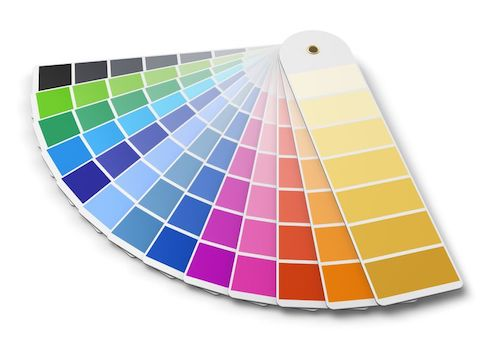

# Android RGBA &nbsp;[](https://travis-ci.org/emoji-gen/android-rgba)

:art: RGBA color string utilities for Java



## Requirements

- Android 4.0.3 (API Level 15) or later

## Getting Started
Please type it in your build.gradle file.

```groovy
repositories {
    jcenter()
}

dependencies {
    compile 'moe.pine.rgba:rgba:0.1.0'
    compile 'moe.pine.rgba:rgba-kotlin:0.1.0' // for Kotlin Extension
}
```

## Usage

```java
int color = RGBAUtils.RGBAToColor("#00ff00ff");
String rgba = RGBAUtils.colorToRGBA(color);
```

```kotlin
val color = "#00ff00ff".toColor()
val rgba = color.toRGBA()
```

## Upload to Bintray

```
$ ./gradlew clean assemble bintrayUpload
```

## License

MIT &copy; [Emoji Generator](https://emoji.pine.moe/)
